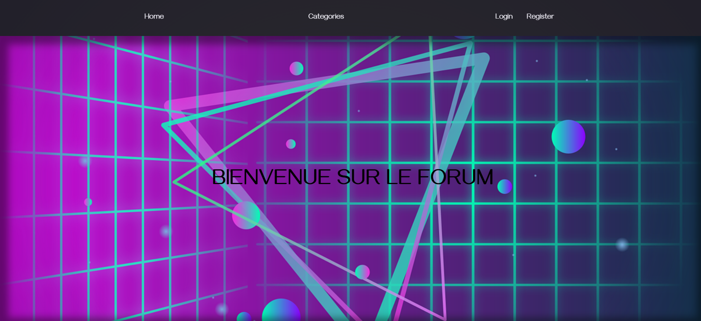
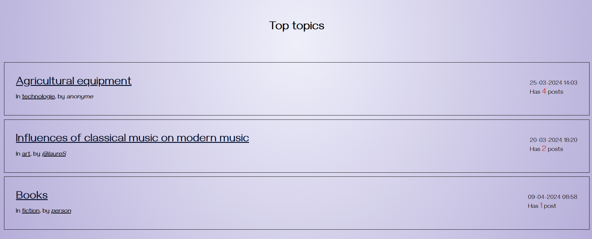
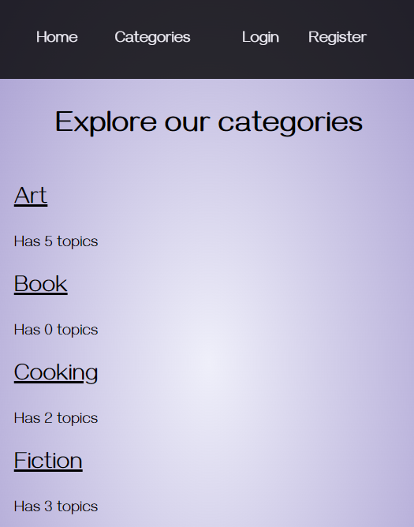

# Exercice forum

Application d'un forum qui contient des catégories, des topics, plusieurs posts et utilisateurs. Possibilité de les vérouiller, modifier, supprimer, en fonction des autorisations (auteur ou admin)

## Rendu

**Version mobile**

## Preparation :
- MCD sur looping
- Maquettage sur figma en mockup
- Méthode kanban et moscow sur trello

## Utilisation:
- Framework créé par Elan Formation, modèle MVC en programmation orientée objet
- PHP, HTML, CSS
- S'utilise avec docker
